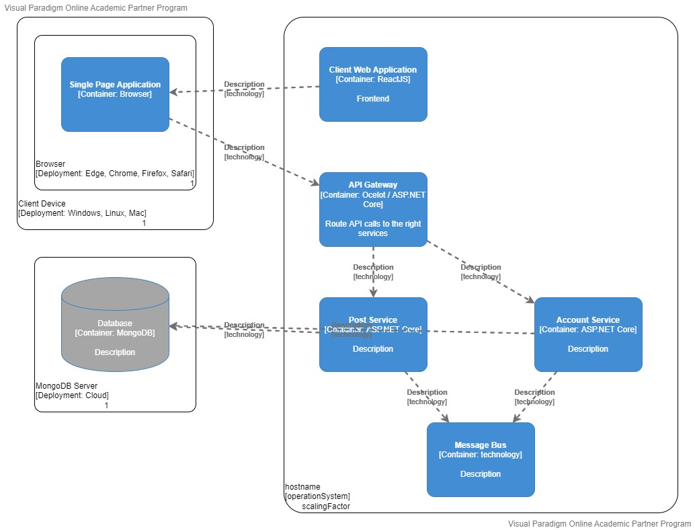

# Physical view

[docs](../info_docs.md) \ [views](./info_views.md) \ physical view

1. Deployment diagram

## Deployment diagram

## Containerization

Our application runs using containers. This allows us to transfer our application to different environments more easily. If for example another service provider becomes cheaper or more favorable for our application, it makes it easier for us to deploy our app on their server.

By using containers it allows us to run our services using a container orchestrator (i.e. kubernetes). kubernetes will automatically scale our services when there is a heavy load. Many cloud providers offer kubernetes as a service along with monitoring tooling.

## Database

Our data will be stored using NoSQL databases. NoSQL databases are usually designed for distributed database environments. They are easier to scale than relational databases.

For our data solution we will use MongoDB. MongoDB is both scalable vertically (Adding more resources to the machine) and horizontally (adding more machines to the environment). 

MongoDB allows for scaling using replication and partitioning. With replication, there are copies made to distribute the load. With partitioning, data is spread over multiple nodes in a cluster.

MongoDB can be used through the MongoDB cloud service where they have a free sandbox tier. It can also run as a container in docker. The benefit of using MongoDB as a cloud service, is that it comes with monitoring tooling. 

## Data Properties

