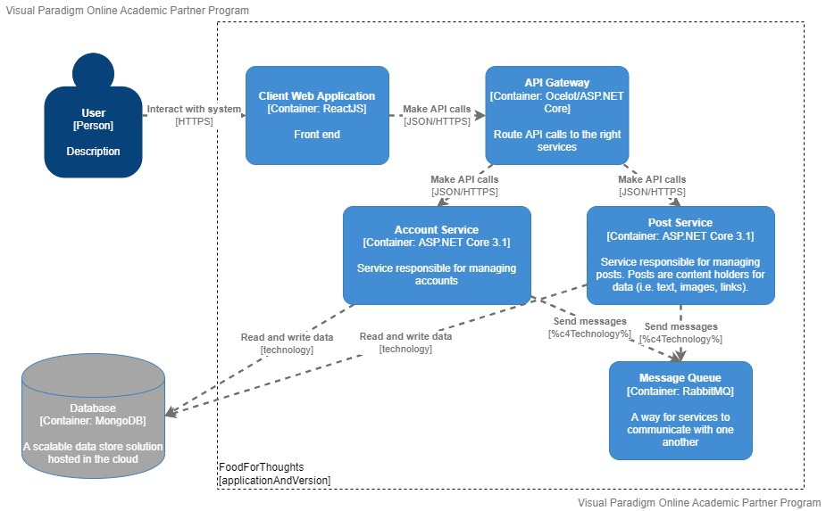

# Documentation

## Table of Content

1. [Introduction](#introduction)
1. [Services](#services)
1. [Technology](#technology)
1. ...

## Introduction

Food-for-Thoughts is a social media platform where users can express their thoughts in small posts.

Anyone who visits the app can view the posts. Users can become a member by creating an account. Members can create their own posts and react to the posts of other members. Members can also follow other members to stay up-to-date with their latest thoughts.

This project will be realized using a microservice architecture. The front-end will be written using React and will communicate with multiple services on the back-end. The back-end services are written in C# using the ASP.NET Core framework. 

## Services
1. [Account service](./services/account_service.md#account-service)
1. [Post service](./services/post_service.md#post-service)

## Technology

[
    TODO: elaborate on,
    1. Web application (frontend)
    2. Web services (backend)
    3. API Gateway (Ocelot)
    4. Messaging (RabbitMQ) https://www.rabbitmq.com/
    5. DevOps (GitHub, DockerHub, CI/CD)
    6. Testing (Selenium)
]: #

**Back-end Framework**  
The back-end will be realized in C# using ASP.Net Core.

**Front-end Framework**  
The front-end will be realized in JavaScript using ReactJS.

I have never worked with React before, so this topic will require research:
How do you set up a project using React?
How do you use React to create a front-end?
How can you test a front-end with React?

**Continuous Integration**  
CI pipeline using Github Actions, no hell configuring things like jenkins or teamCity, just configure in the github repository.

**Testing**  
The back-end will be tested using unit tests.
The front-end can also be tested, React has its own testing library.
Acceptance testing using selenium.
The overall project will go through static code coverage of SonarCloud.
