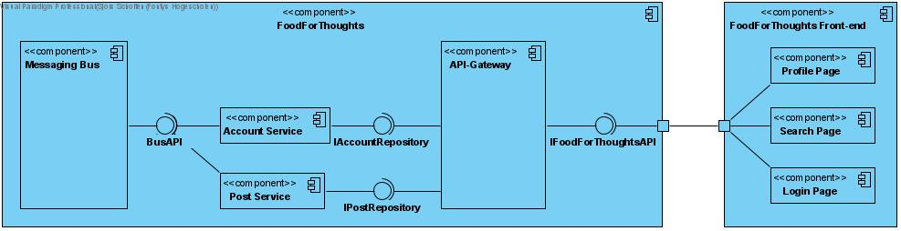

# Development view

[docs](../info_docs.md) \ [views](./info_views.md) \ development view

1. Component diagram

## Component Diagram

The food for thoughts system is made out of multiple micro-services:
1. Entry Service
2. Account Service
3. Post Service

The services are accessible through an api-gateway. The api-gateway will make use of Ocelot as a gateway framework.

The React front-end will consist out of multiple web pages:
1. Login page, this is where the user can get authenticated or create a new account.
2. Profile page, this where an authenticated user can see and manage his profile.
3. Search page, this is where users can search for posts and other users.

[
    The back-end services communicate with each other through a message bus.
    TODO: investigate message bus implementations
]: #