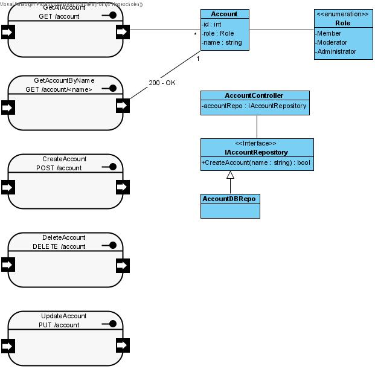
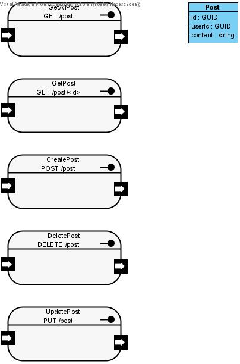
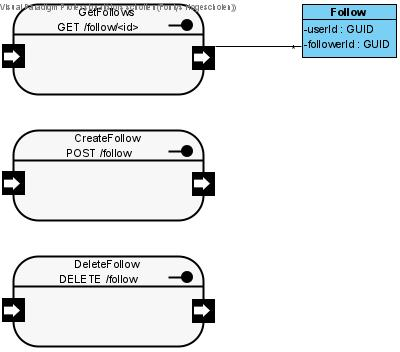

# Logical View

[docs](../info_docs.md) \ [views](./info_views.md) \ logical view

1. Class Diagrams
    1. Account Service
    2. Post Service
    3. Follow Service
    4. React Service

## Account Service

## Post Service

## Follow Service

## React Service

