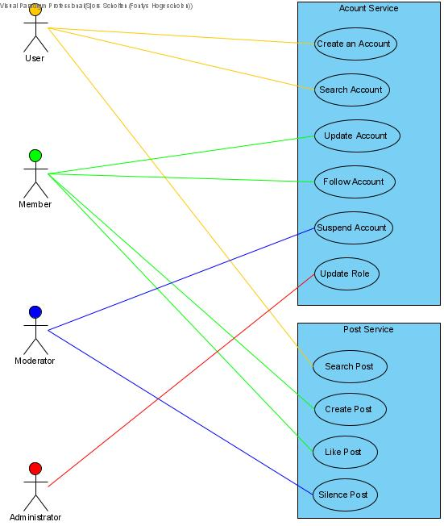

# Use Case View

[docs](../info_docs.md) \ [views](./info_views.md) \ use case view

1. Use Case Diagram
1. Use Cases
	1. Account Service
	1. Post Service

## Use Case Diagram

## Actors

| Type | Description |
|---|---|
| User | someone who has not yet been authenticated |
| Member | someone who has created an account and has been authenticated |
| Moderator | someone who has created an account, has been authenticated, and is authorized with the role 'mod' |
| Administrator | someone who has created an account, has been authenticated, and is authorized with the role 'admin' |

## Use Cases

### Account Service

---

#### UC01_CreateAccount

**Name:** UC01_CreateAccount  
**Description:** As a user i want to create an account  
**Actors:** User

**Pre-condition:**
None

**Steps:**
1. The User navigates to the account creation page
2. The User fills in the form with login credentials
3. The System will precheck the input fields for faults
4. The User submits the form
5. The System will send a REST call with the data to the account service
6. The System will create an entry for the account
7. The System will return the id of the created account
8. The System will show the user the account page

---

**Name:** UC02_SearchAccount  
**Description:** As a user i want to create an account  
**Actors:** User

**Pre-condition:**
None

**Steps:**
1. The User will submit a value
2. The System will send a REST call with the data to the account service
3. The System will return the entry with the given value [^UC02_1][^UC02_2]
4. The System will show the account page of the given entry

[^UC02_1]: If the value is null, return all entries

[^UC02_2]: If the entry does not exist, return nothing

---