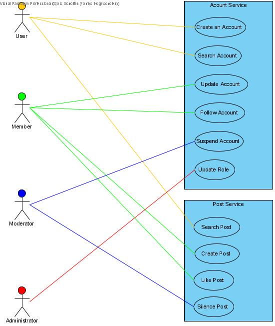

# Use Case View

[docs](../info_docs.md) \ [views](./info_views.md) \ use case view

1. Use Case Diagram
1. Use Cases
	1. Account Service
	1. Post Service

## Use Case Diagram

## Actors

| Type | Description |
|---|---|
| User | someone who has not yet been authenticated |
| Member | someone who has created an account and has been authenticated |
| Moderator | someone who has created an account, has been authenticated, and is authorized with the role 'mod' |
| Administrator | someone who has created an account, has been authenticated, and is authorized with the role 'admin' |

## Use Cases

### Account Service

---

**Name:** UC01_CreateAccount  
**Description:** As a user i want to create an account  
**Actors:** User

**Pre-condition:**
None

**Steps:**
1. The User navigates to the account creation page
1. The User fills in the form with account info and login credentials
1. The System will precheck the input fields for faults
1. The User submits the form
1. The System will send a REST call with the data to the account service
1. The System will create a new account with the data
1. The System will return the ID of the created account
1. The System will show the user the account page

---

**Name:** UC02_SearchAccount  
**Description:** As a user i want to create an account  
**Actors:** User

**Pre-condition:**
None

**Steps:**
1. The User will submit a value
2. The System will send a REST call with the data to the account service
3. The System will return the entry with the given value [^UC02_1][^UC02_2]
4. The System will show the account page of the given entry

[^UC02_1]: If the value is null, return all entries

[^UC02_2]: If the entry does not exist, return nothing

---

**Name:** UC03_UpdateAccount  
**Description:** As a user i want to update my account information 
**Actors:** Member

**Pre-condition:**
none

**Steps:**
1. The User navigates to the account modification page
1. The User edits the form
1. The System checks the form for faults
1. The User submits the form
1. The System sends a REST call to the account service
1. The System updates the account data.
1. The System returns the result of the action
1. The System will show the account info page with the new data.

---

**Name:** UC04_FollowAccount  
**Description:** As a user i want to follow an account 
**Actors:** Member

**Pre-condition:**
none

**Steps:**
1. The User presses a follow button on an account.
1. The System will send a REST call to the account service.
1. The System will create a new follow with the user account and the follow account.
1. The system will return the result of the action.
1. The System will show the followers' page of the user.

---

**Name:** UC05_SuspendAccount  
**Description:** As a user i want to update my account information 
**Actors:** Moderator

**Pre-condition:**
none

**Steps:**
1. The User navigates to the account creation page

---

**Name:** UC06_UpdateRole  
**Description:** As a user i want to update my account information 
**Actors:** Member

**Pre-condition:**
none

**Steps:**
1. The User navigates to the account creation page

---

 

### Post Service

---

**Name:** UC07_SearchPost  
**Description:** As a user i want to update my account information 
**Actors:** User

**Pre-condition:**
none

**Steps:**
1. The User navigates to the account creation page

---

**Name:** UC08_CreatePost  
**Description:** As a user i want to update my account information 
**Actors:** Member

**Pre-condition:**
none

**Steps:**
1. The User navigates to the account creation page

---

**Name:** UC09_LikePost  
**Description:** As a user i want to update my account information 
**Actors:** Member

**Pre-condition:**
none

**Steps:**
1. The User navigates to the account creation page

---

**Name:** UC10_SilencePost  
**Description:** As a user i want to update my account information 
**Actors:** Member

**Pre-condition:**
none

**Steps:**
1. The User navigates to the account creation page

---